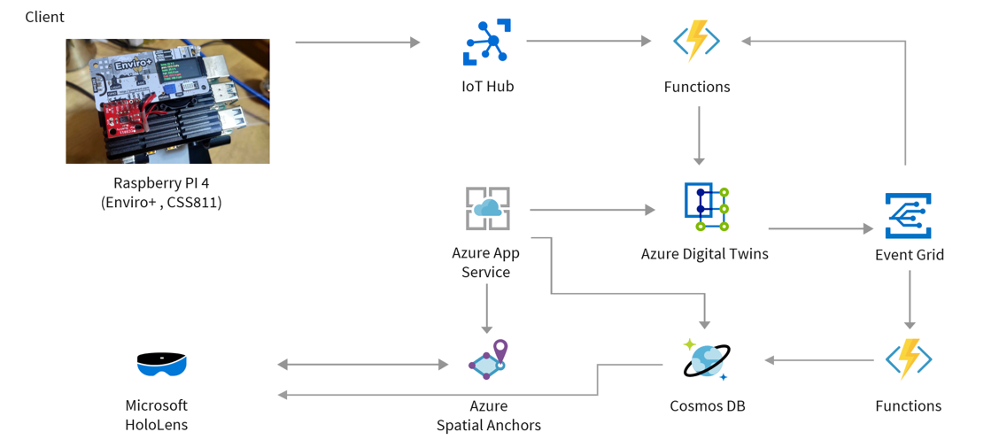

# DigitalTwinsDemoSystem - Azure Digital Twinsを利用したIoT エッジデバイスの管理

このサンプルはIoT エッジの管理（主にメンテナンス）において現場作業支援を前提とした一連のデモシステムとなっています。

## アーキテクチャについて

ベースとなるアーキテクチャは[Azure Architecture Center](https://docs.microsoft.com/ja-jp/azure/architecture/?WT.mc_id=MR-MVP-5003104)で公開されている以下を参考にしています。
* [複合現実と IoT による設備管理の促進](https://docs.microsoft.com/ja-jp/azure/architecture/solution-ideas/articles/facilities-management-powered-by-mixed-reality-and-iot?WT.mc_id=MR-MVP-5003104)

上記アーキテクチャに加えて、Azure Iot Hubを活用してAzure Digital Twinsにセンサーの生データを格納するように変更しています。

## 開発環境
開発環境は以下の通りです。
### HoloLens 2 & Azure開発環境

* Windows 10 Pro
* Unity 2019.4.10f1
* Mixed Reality Toolkit V2.5.1
* Azure Spatial Anchors V2.6.0
* Visual Studio 2019(16.5.3)

### Raspberrypi開発環境

* Visual Studio Code 1.50.1
* Plugins: Azure IoT Hub(動作確認用),Remote Development
* Node.js
    * v8.11.3(Raspberry PI Beacon化
    * v10.13.0(Azure IoT Hubとの連携)
* Python:3.7.3(センサー情報収集、Json化)

### 利用するAzureサービスと参考にしたリファレンス

* [Azure Spatial Anchors](https://docs.microsoft.com/ja-jp/azure/spatial-anchors/?WT.mc_id=MR-MVP-5003104)
    * [C# で粗い再局在化を使用してアンカーを作成して配置する方法](https://docs.microsoft.com/ja-jp/azure/spatial-anchors/how-tos/set-up-coarse-reloc-unity?WT.mc_id=MR-MVP-5003104)
* [Azure IoT Hub](https://docs.microsoft.com/ja-jp/azure/iot-hub/?WT.mc_id=MR-MVP-5003104)
    * クイックスタート：[デバイスから IoT ハブに利用統計情報を送信してバックエンド アプリケーションで読み取る (Node.js) ](https://docs.microsoft.com/ja-jp/azure/iot-hub/quickstart-send-telemetry-node?WT.mc_id=MR-MVP-5003104)
* [Azure Digital Twins](https://docs.microsoft.com/ja-jp/azure/digital-twins/?WT.mc_id=MR-MVP-5003104)
    * チュートリアル：[エンド ツー エンドのソリューションを構築する](https://docs.microsoft.com/ja-jp/azure/digital-twins/tutorial-end-to-end?WT.mc_id=MR-MVP-5003104)
    * クイック スタート：[ADT Explorer を使用して、Azure Digital Twins のサンプル シナリオを精査する](https://docs.microsoft.com/ja-jp/azure/digital-twins/quickstart-adt-explorer?WT.mc_id=MR-MVP-5003104)

* [Azure Cosmos DB](https://docs.microsoft.com/ja-jp/azure/cosmos-db/?WT.mc_id=MR-MVP-5003104)
* [Azure Funtions](https://docs.microsoft.com/ja-jp/azure/azure-functions/?WT.mc_id=MR-MVP-5003104) 
    * [Azure Functions 2.x 以降に対する Azure Cosmos DB の入力バインド](https://docs.microsoft.com/ja-jp/azure/azure-functions/functions-bindings-cosmosdb-v2-input?WT.mc_id=MR-MVP-5003104&tabs=csharp#example)
    * [Azure Functions 2.x 以降に対する Azure Cosmos DB の出力バインド](https://docs.microsoft.com/ja-jp/azure/azure-functions/functions-bindings-cosmosdb-v2-output?WT.mc_id=MR-MVP-5003104&tabs=csharp#example)

## 詳細説明

### センサーデバイス
### Azure サービス

### HoloLens 2での可視化
後日記載...

